# Application Flow: PaletteOS

## Purpose
Define the technical lifecycle and data flow of the application from initialization to heavy processing, ensuring state remains consistent and performance remains high.

## Architecture

```mermaid
sequenceDiagram
    participant U as User
    participant UI as React UI (Features)
    participant S as Store (Zustand)
    participant E as Core Engines
    participant API as Backend/AI

    U->>UI: Selects Base Color
    UI->>S: Dispatch(SetBaseColor)
    S->>E: trigger generatePalette(baseColor, rule)
    E-->>S: Return Full Palette Array
    S-->>UI: Update View (Palette)
    
    rect rgb(30, 30, 30)
    Note over UI,E: Background Processing
    S->>E: trigger runAccessibilityAudit(Palette)
    E-->>S: Return Audit Results (Pass/Fail)
    S-->>UI: Update View (Warning Badges)
    end

    U->>UI: Clicks "AI Fix"
    UI->>API: POST /api/fix { palette, auditResults }
    API-->>UI: Return Corrected Palette
    UI->>S: Dispatch(UpdatePalette)
```

## Core Lifecycles

### Initialization (App Load)
1. Load user preferences (Dark/Light mode) from local storage.
2. Rehydrate Zustand store with the last active palette/project.
3. Render UI.

### The "Engine Pipeline"
Because evaluating a palette requires multiple steps, we use an engine pipeline:
1. **Mutation**: User changes a color.
2. **Generation**: `color-engine` recalculates the scale (if applicable).
3. **Evaluation**: `scoring-engine` recalculates the score.
4. **Validation**: `accessibility-engine` recalculates contrast matrices.
5. **Update**: Global state is updated, UI re-renders.

## Scalability Considerations
- **Debouncing**: The Engine Pipeline must be debounced during rapid UI interactions (e.g., dragging a color slider) to prevent freezing the main thread.
- **Web Workers**: If the `accessibility-engine` matrix calculation becomes too heavy for large palettes (e.g., testing 10 colors against 10 colors = 100 calculations per frame), it must be offloaded to a Web Worker.

## Best Practices
- Keep React Components "dumb". They should simply dispatch actions to the Store, and the Store should orchestrate the Engine Pipeline.

## Developer Notes
- Watch out for circular dependencies between the engines. Engines should be standalone, and the Store should coordinate them.
