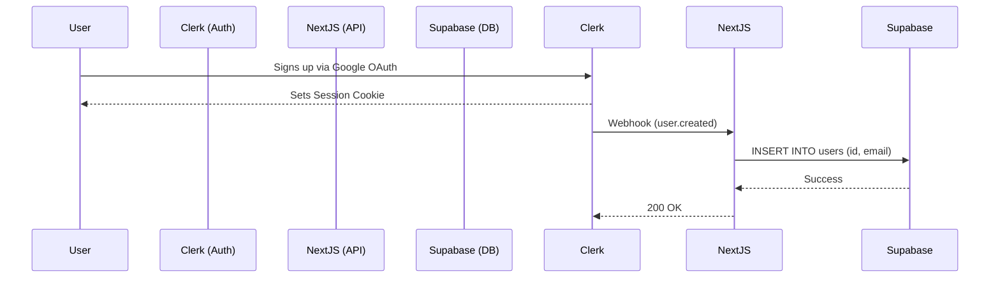

# Authentication Plan: PaletteOS

## Purpose
Define the strategy for user identity management, ensuring secure access to workspaces, projects, and saved palettes, while maintaining a frictionless onboarding experience.

## Architecture

We will utilize a modern Identity-as-a-Service (IDaaS) provider. 
*Selected Provider: **Clerk** (Preferred for React/Next.js due to excellent UI components and edge-compatibility).*

### Authentication Flow
1. **Public Access:** Users can generate and test palettes without an account. LocalStorage retains their session data.
2. **Sign Up Trigger:** When a user clicks "Save Palette" or "Create Project", they are prompted to authenticate.
3. **OAuth / Magic Link:** Users authenticate via Google, GitHub, or Magic Link (passwordless).
4. **Session Creation:** Clerk sets a secure HttpOnly cookie.
5. **Database Sync:** A webhook from Clerk hits `/api/webhooks/user-created` to create a mirror user record in our Supabase database for relational integrity.

## Responsibilities
- **Frontend**: Protect specific routes (`/dashboard`, `/settings`) using Next.js Middleware.
- **Backend**: Validate the session token on every protected API route before executing database queries.

## Best Practices
- **Frictionless Onboarding**: Do not require passwords. OAuth and Magic Links provide a higher conversion rate for SaaS tools.
- **Graceful Degradation**: If the user is unauthenticated, the app should still function perfectly as a standalone utility tool.

## Risks
- The webhook sync between Clerk and Supabase can fail, leading to a state where the user is authenticated but has no database record.
  - *Mitigation*: Implement retry logic on the webhook handler and a fallback "upsert" check when the user first visits the dashboard.

## Developer Notes
- Rely on Clerk's `<SignedIn>` and `<SignedOut>` React components for conditional rendering of UI elements like the "Save" button vs "Log in to Save" button.
