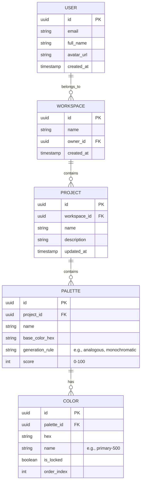

# Database Plan: PaletteOS

## Purpose
Define the database schema and architecture required to support user accounts, project management, and saved palettes in PaletteOS.

## Architecture

We are utilizing a relational database (PostgreSQL via Supabase).

### Entity Relationship Diagram

## Responsibilities
- **Data Integrity**: Enforce foreign key constraints so that deleting a project cascades to its palettes and colors.
- **Performance**: Ensure rapid fetching of complex palettes.
- **Security**: Implement Row Level Security (RLS) to ensure users can only access data within their authorized workspaces.

## Best Practices
- **JSONB Optimization**: Instead of the `COLOR` table shown above (which creates many rows), if a palette always contains a strict schema of colors, it might be heavily optimized by storing the colors array as a `JSONB` column inside the `PALETTE` table.
  - *Recommendation*: Use `JSONB` for `colors` inside `PALETTE` to reduce join overhead, as colors are rarely queried independently of their parent palette.

## Scalability Considerations
- **Row Level Security (RLS)** is crucial since we are using a Backend-as-a-Service (Supabase). RLS policies must be bulletproof.
- Use connection pooling (PgBouncer) provided by Supabase to handle high connection churn from Next.js serverless API routes.

## Risks
- Unoptimized queries on the `PALETTE` table could slow down the Dashboard if a user has hundreds of saved palettes. Proper indexing on `workspace_id` and `updated_at` is required.

## Developer Notes
- Ensure all DB migrations are tracked using a tool like Drizzle Kit or Prisma Migrate. Do not make manual schema changes in the production dashboard.
