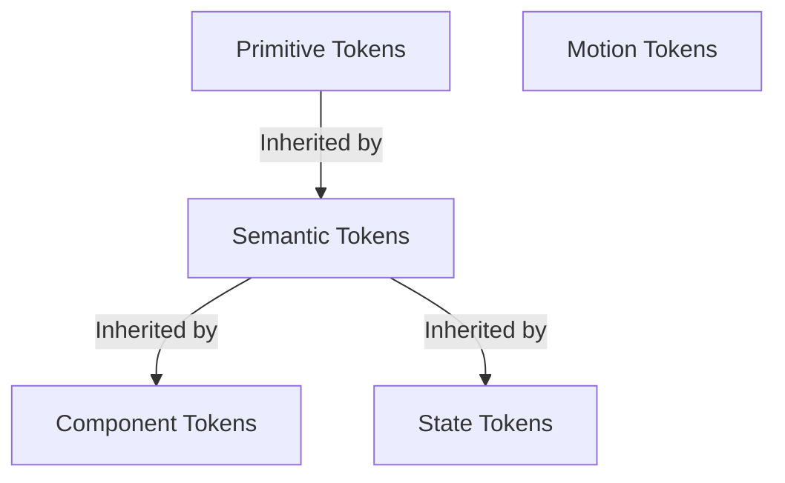

# Design Tokens: PaletteOS

## Purpose
This document specifies the design token architecture of PaletteOS. It establishes the token categories (Primitive, Semantic, Component, State, Motion), structure definitions, and our automated framework export strategy.

---

## 1. Token Hierarchy



### 1. Primitive Tokens (Global Constants)
Raw color values mapped directly to color constants. Never used directly in component styling.
- `color-gray-50`: `#f9f9fb`
- `color-gray-900`: `#18181b`
- `color-blue-500`: `#3b82f6`
- `color-red-500`: `#ef4444`

### 2. Semantic Tokens (Theme Roles)
Tokens defining functional context (background, text, surface, statuses).
- `sys-bg`: `color-gray-950` (in Dark Mode) or `color-gray-50` (in Light Mode)
- `sys-text-primary`: `color-gray-100` (in Dark Mode) or `color-gray-900` (in Light Mode)
- `sys-brand-primary`: `color-blue-500`
- `sys-semantic-error`: `color-red-500`

### 3. Component Tokens
Variables mapping specifically to individual component properties.
- `btn-primary-bg`: `sys-brand-primary`
- `btn-primary-text`: `color-white`
- `card-surface-bg`: `sys-surface-primary`

### 4. State & Interactive Tokens
Modifiers defining interactive states (hover, focus, disabled).
- `state-hover-overlay`: `rgba(255, 255, 255, 0.08)`
- `state-focus-ring`: `sys-brand-primary`

### 5. Motion & Animation Tokens
Standard duration and easing configurations matching `ANIMATION_GUIDE.md`.
- `motion-duration-snappy`: `150ms`
- `motion-duration-smooth`: `300ms`
- `motion-easing-snappy`: `cubic-bezier(0.32, 0.72, 0, 1)`

---

## 2. CSS Variable Mapping Example
```css
:root {
  /* Primitives */
  --color-blue-500: #3b82f6;
  --color-zinc-950: #09090b;
  --color-zinc-900: #18181b;
  --color-zinc-100: #f4f4f5;

  /* Semantics */
  --sys-bg: var(--color-zinc-950);
  --sys-surface: var(--color-zinc-900);
  --sys-text: var(--color-zinc-100);
  --sys-brand: var(--color-blue-500);

  /* Elevation */
  --shadow-sm: 0 1px 2px 0 rgba(0, 0, 0, 0.05);
  --shadow-md: 0 4px 6px -1px rgba(0, 0, 0, 0.1);
  --shadow-lg: 0 10px 15px -3px rgba(0, 0, 0, 0.1);
}
```

## 3. Design Token Export Strategy
When translating the user's generated color palette, the **Export Engine** converts internal theme models into a standardized JSON structure matching the **W3C Design Tokens Community Group** specification:
```json
{
  "color": {
    "primary": {
      "500": {
        "$value": "#3b82f6",
        "$type": "color"
      }
    }
  }
}
```

## Developer Notes
- Ensure all custom tailwind classes utilize variables mapping directly to these CSS tokens inside `tailwind.config.ts`.
