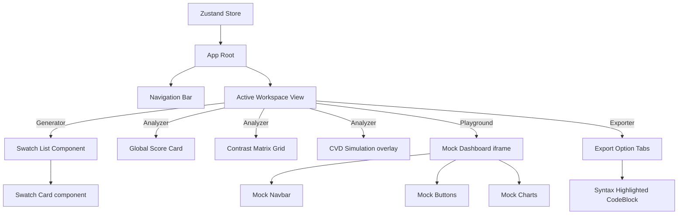

# Information Architecture: PaletteOS

## Purpose
This document establishes the structural organization, navigation hierarchies, and key relationships of components and data flows within the PaletteOS platform.

---

## 1. Site Map & Navigation Tree

```text
PaletteOS Web App (Root)
├── Landing Page (Marketing, USP, Feature Previews, Guest Generator Gate)
├── App Portal
│   ├── Guest Workspace (LocalStorage-based)
│   │   ├── Palette Generator (Scale builder, Locks)
│   │   ├── Palette Analyzer (Health report card, Contrast grid)
│   │   └── Export Workspace (CSS, JS Tailwind, design tokens JSON)
│   ├── Authentication (Sign Up / Sign In via Clerk)
│   └── User Dashboard (Authenticated, Protected via middleware)
│       ├── Workspaces Selector (Switch contexts)
│       ├── Projects Folders (List, Create, Delete)
│       │   └── Palettes Dashboard (Revision lists)
│       │       ├── Edit Mode (Generates scale, locks)
│       │       ├── Analysis Mode (Scoring, Contrast Matrix, CVD simulator)
│       │       ├── Components Playground (Dashboard mock component, Light/Dark toggle)
│       │       └── Export Manager (Download, Clipboard copy)
│       └── User Settings
│           ├── Profile Configurations
│           └── Organization Workspace default parameters (WCAG AA/AAA limits)
```

---

## 2. Component & Entity Relationships

The diagram below shows how the React components correspond to the global state stores.



## 3. Data & Interaction Flow

1. **Instantiation**: The client app loads. If token cookie is found, Zustand store fetches project details from Supabase `/api/v1/projects`; otherwise, rehydrates state from `localStorage` under guest workspace.
2. **Swatch Manipulation**: Dragging a lightness slider on a color swatch modifies the selected color's properties.
3. **Calculation Pipelines**: 
   - Modifying a color triggers `useStore.getState().updateColor()`.
   - The Store sends the color array to `ColorEngine` to map the shade array.
   - The updated array is evaluated by the `AccessibilityEngine` (matrix contrast calculations) and the `ScoringEngine` (recalculating the 0-100 overall score).
   - Once computation resolves, the UI renders the changes.

## Developer Notes
- Do not create state dependencies between siblings. Use Zustand to pass state from Swatch changes directly to the Playground and Exporter panels.
