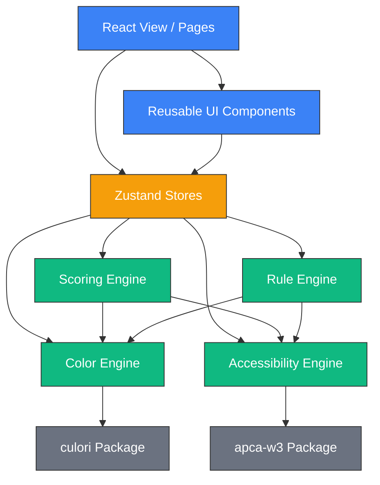

# Module Dependency Graph: PaletteOS

## Purpose
This document maps import boundaries and code dependencies across PaletteOS. It enforces strict separation of concerns, ensuring core math engines remain free of UI dependencies.

---

## 1. Dependency Model

---

## 2. Dependency Rules

### Rule 1: Engine Purity
Files within `/src/engines/*` are strictly pure TypeScript:
- **NO React imports** (`useState`, `useEffect`, `React.FC`).
- **NO store imports** (does not subscribe to Zustand or Context).
- **NO DOM dependencies** (does not read `document`, `window`, or local storage).
This ensures engines are fully testable in Node/Vitest environments and can be compiled into CLI binaries or worker threads.

### Rule 2: Unidirectional UI to Store Flow
UI components must never perform direct color calculations or access external APIs. They read values from the Zustand stores and trigger actions.
- *Bad*: `const ratio = getContrastRatio(hex1, hex2)` inside a button component.
- *Good*: `const ratio = useStore(state => state.activeContrastMatrix[hex1][hex2])`.

## Developer Notes
- Run dependency graph checks during PR reviews to verify no circular dependencies are introduced.
