```mermaid
graph TD
    classDef must fill:#ef4444,stroke:#333,stroke-width:2px,color:#fff;
    classDef should fill:#f59e0b,stroke:#333,stroke-width:2px,color:#fff;
    classDef could fill:#3b82f6,stroke:#333,stroke-width:2px,color:#fff;
    classDef wont fill:#6b7280,stroke:#333,stroke-width:2px,color:#fff;

    M[Must Have]:::must
    S[Should Have]:::should
    C[Could Have]:::could
    W[Won't Have Yet]:::wont

    M --> M1[OKLCH Color Engine]
    M --> M2[WCAG 2.1 Contrast Matrix]
    M --> M3[Local Storage Save State]
    M --> M4[Export Engine: CSS / Tailwind / JSON]

    S --> S1[Screenshot Analyzer client-side]
    S --> S2[Color Blindness Simulation matrix]
    S --> S3[Interactive Components Playground]
    S --> S4[Clerk Auth & PostgreSQL Sync]

    C --> C1[Heuristic Scoring Engine]
    C --> C2[APCA Contrast Calculations]
    C --> C3[AI explanation engine]
    C --> C4[Dark/Light theme toggle simulator]

    W --> W1[Figma Plugin integration]
    W --> W2[Continuous Integration CI CLI tool]
    W --> W3[Team billing & Shared Workspace subscriptions]
```

# MVP Scope (MoSCoW Matrix): PaletteOS

## Purpose
This document establishes the initial MVP parameters for PaletteOS. We use the MoSCoW framework (Must Have, Should Have, Could Have, Won't Have) to prevent scope creep during the core execution phase.

---

---

## 1. MUST HAVE (The MVP Foundation)
These features are critical. If any of these are missing, the product cannot launch:
- **OKLCH Core Color Engine**: Precision math for color spaces (Hex, RGB, HSL, OKLCH).
- **Contrast Matrix Checker**: Calculates WCAG 2.1 AA/AAA contrast ratios for text combinations.
- **Dynamic Scale Generation**: Expands a single base color into a standard 50-950 swatch array.
- **Code Export Exporter**: Immediate output to standard CSS custom variables, Tailwind extensions, and raw JSON formats.
- **Session Continuity**: LocalStorage state preservation so guest users don't lose active edits.

## 2. SHOULD HAVE (The SaaS Enhancements)
High-priority features that are not strictly blocking launch, but add substantial competitive value:
- **Interactive Component Playground**: Testing generated colors on actual mock buttons, dashboards, and cards dynamically.
- **Color Blindness Simulator Matrix**: Brettel algorithm projection filters (Deuteranopia, Protanopia, Tritanopia).
- **Screenshot Analyzer**: Client-side dominant color extractor via Canvas manipulation.
- **PostgreSQL User Database**: Clerk Auth integration to save palettes and organize workspaces on the cloud.

## 3. COULD HAVE (The AI & Advanced Math Suite)
Lower priority items that can be deferred or developed as progressive enhancements:
- **Scoring Engine**: Detailed 100-point visual grading algorithm (deductions, harmony weights).
- **APCA Contrast support**: WCAG 3.0 draft standard calculations.
- **AI explanation engine**: OpenAI integrations to generate semantic feedback on contrast failures.

## 4. WON'T HAVE YET (Future Scope)
Excluded from MVP and initial releases:
- **Figma Integration Plugin**: Export and sync systems directly to Figma layers.
- **Headless CLI Auditing**: Running color audits as a GitHub action step.
- **Team Workspaces & Billing**: Enterprise access controls and collaborative editor modes.

## Developer Notes
- Ensure code architecture (specifically components and stores) is designed with placeholders for "Should Have" and "Could Have" features so they can be injected without breaking the MVP core.
