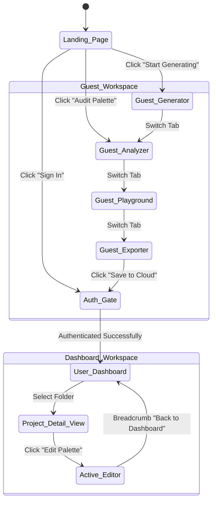

# Navigation Map: PaletteOS

## Purpose
This document maps out the specific user navigation paths, click sequences, and routing maps within the PaletteOS platform, describing how users move across various screens and modes.

---

## 1. Routing Definition Matrix

The application handles routing using Next.js App Router folders.

| URL Path | Access Level | Primary Actions | Target View |
| :--- | :--- | :--- | :--- |
| `/` | Public | Explore Features, Quick Sandbox | Marketing Landing |
| `/generator` | Public / Guest | Choose Base seed, locks, scale modifications | Core Workspace (Generator Mode) |
| `/analyzer` | Public / Guest | Check contrast matrices, audit overall score | Core Workspace (Analysis Mode) |
| `/playground` | Public / Guest | Preview colors on mockup components | Core Workspace (Preview Mode) |
| `/export` | Public / Guest | Clipboard copies, token downloads | Core Workspace (Export Mode) |
| `/dashboard` | Authenticated | Folder lists, Workspace context toggle | Protected User Dashboard |
| `/projects/:id` | Authenticated | Manage workspaces, add palettes, rename folders | Project Dashboard View |
| `/settings` | Authenticated | Manage custom standard levels (AA/AAA), profile | Settings Workspace |

---

## 2. Interaction Navigation Map

## 3. UI Tab Navigation Lifecycle
Inside the active editor (`/generator`, `/analyzer`, etc.), the interface uses a persistent secondary navigation bar (sub-header). Selecting a sub-tab triggers a state update (`setView`) without requiring a full page refresh:
1. User clicks the "Component Playground" sub-tab.
2. The URL updates to `/playground` (or sets route state parameter).
3. The viewport fades the color generator out, loading the Component Playground iframe mockups in under 100ms.
4. The active colors are passed dynamically to the playground frame wrapper.

## Developer Notes
- Ensure all page-level redirects (e.g. from `/dashboard` to Auth gate if cookie is expired) occur via Next.js Middleware (`middleware.ts`) on the server to prevent flashing unauthenticated UI containers.
