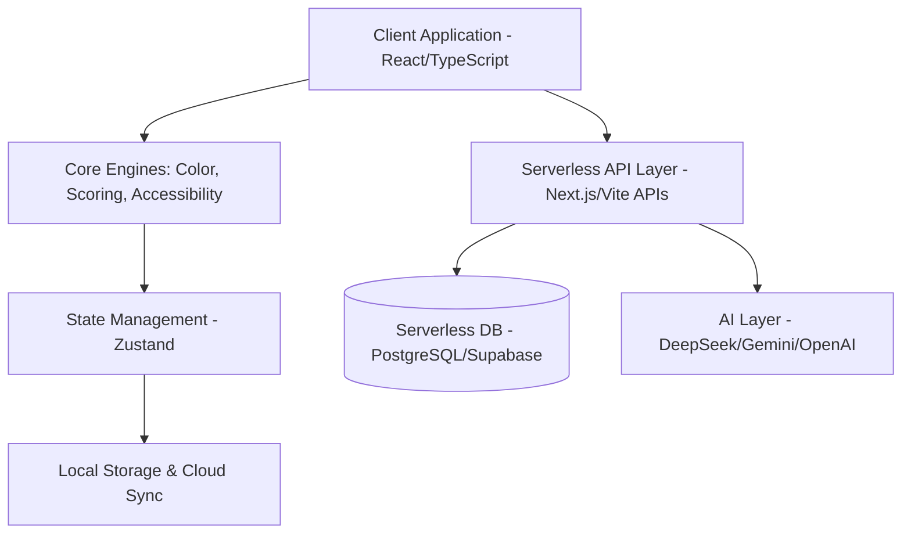

# Project Overview: PaletteOS

## Purpose
PaletteOS is an intelligent Color Intelligence Platform that transforms the way designers and developers build, analyze, test, and apply color systems. It bridges the gap between aesthetic design and technical implementation by offering robust accessibility testing, automated scoring, AI-driven recommendations, and frictionless export to multiple frameworks.

## Responsibilities
- **Color System Generation**: Provide intuitive tools to build complete color palettes from scratch or based on uploaded images.
- **Accessibility & Compliance**: Ensure every generated palette is tested against WCAG standards, highlighting failures and suggesting automated fixes.
- **Analytics & Scoring**: Score palettes across various dimensions (contrast, harmony, accessibility, brand alignment).
- **Export & Integration**: Output production-ready design tokens, Tailwind configs, CSS variables, and specific framework themes.
- **Collaboration & Continuity**: Store, version-control, and share palettes across teams (Future feature).

## Architecture (High-Level)
PaletteOS follows a modern, scalable client-side heavy architecture with stateful persistence, utilizing serverless functions and a serverless database for operations that require heavy lifting (e.g., AI integration, database syncing).

## Folder References
- `/src/engines`: Core logic for color manipulation, scoring, and accessibility checks.
- `/src/components`: UI elements based on our design system.
- `/src/store`: Global state management.

## Best Practices
- **Separation of Concerns**: UI components strictly display data; color math and logic reside in `/engines`.
- **Accessibility First**: The application UI itself must be perfectly accessible (ARIA, keyboard nav), acting as a showcase for the product.
- **Skill Utilization**: Driven by `docs-architect` for structuring and `accessibility-compliance-accessibility-audit` for validating logic.

## Scalability Considerations
- Heavy color computations must be optimized (e.g., using Web Workers if necessary).
- Database schemas must be designed to support multi-tenant team collaboration in the future.

## Risks
- Color analysis algorithms can become computationally expensive, leading to poor UI performance.
- AI hallucinations in color explanation/suggestions.

## Future Improvements
- Cloud Sync & Team Collaboration modules.
- Figma Plugin and Browser Extensions for extracting colors from live websites.

## Developer Notes
- Ensure all color engines are fully unit-tested, as they are the backbone of the application.
- Adhere strictly to the defined `DESIGN_SYSTEM.md` when building UI.
