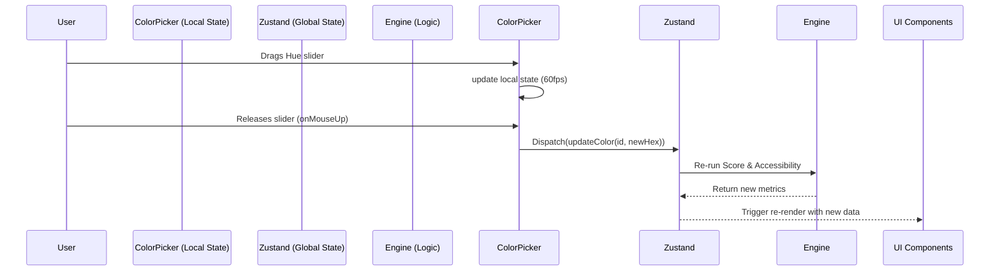

# State Management: PaletteOS

## Purpose
Define the strategy for managing global, local, and server state within PaletteOS to ensure predictable data flow and a responsive UI.

## Architecture

We use a multi-tiered state strategy:

### 1. Global UI State (Zustand)
Used for transient state that needs to be accessed by deeply nested components.
- Active Theme (Dark/Light)
- Active Workspace ID
- UI Toggles (e.g., "Show Contrast Scores", "Color Blindness Simulator Mode")
- Current unsaved Palette configuration (colors, rules).

### 2. Server State (React Query / SWR)
Used for asynchronous data fetching, caching, synchronization, and optimistic updates.
- Fetching list of Projects.
- Fetching saved Palettes.
- Saving/Updating a Palette (Mutation).

### 3. Local Component State (React `useState` / `useReducer`)
Used for strictly isolated state.
- Form input values (e.g., typing a Hex code before pressing enter).
- Dropdown open/close boolean.
- Local animation states.

### 4. URL State (Query Parameters)
Used for shareability.
- If an unauthenticated user generates a palette, the URL should update with the parameters:
  `?base=3B82F6&rule=analogous&steps=9`
- This allows users to share palettes simply by copying the URL.

## Flow Diagram: Updating a Color

## Best Practices
- **Avoid Global State Clutter**: Do not put form inputs or toggle states in Zustand unless absolutely necessary for sibling component communication.
- **Optimistic Updates**: When saving a palette to the database, update the UI immediately assuming success, and rollback if the API fails.
- **Debouncing**: Throttle or debounce rapid state changes (like color dragging) before committing them to the global store to prevent performance degradation.

## Scalability Considerations
- As the application grows, split the Zustand store into slices (e.g., `createThemeSlice`, `createUISlice`, `createProjectSlice`) to maintain readability.

## Developer Notes
- We explicitly avoid Redux due to boilerplate. Zustand provides a much leaner API that aligns better with our fast-paced component rendering needs.
