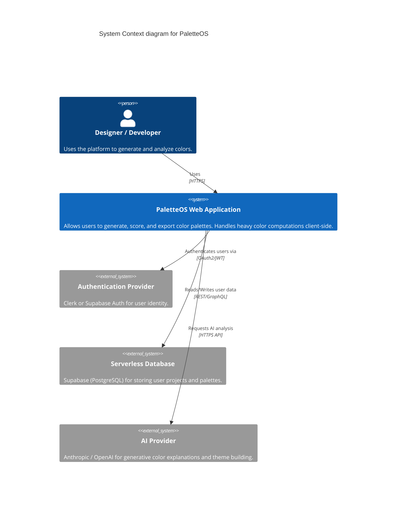

# System Architecture: PaletteOS

## Purpose
Detail the structural design of PaletteOS, defining how components, logic, state, and external services interact to create a highly scalable and resilient application.

## Responsibilities
- Provide a blueprint for technical decision-making.
- Ensure the application can handle intensive client-side computations (color math).
- Define the boundary between Client (Browser) and Server (Serverless API).

## Architecture (C4 Model Context)

## Layers

### 1. Presentation Layer (React)
- Renders the UI based on state.
- Highly decoupled from business logic. Uses custom hooks to access engines.

### 2. State & Orchestration Layer (Zustand)
- Coordinates actions between the UI and the Core Engines.
- Handles optimistic updates and local persistence.

### 3. Core Engine Layer (Pure TypeScript)
- Contains all heavy computational logic (`color-engine`, `scoring-engine`, `accessibility-engine`).
- Designed to be framework-agnostic.

### 4. API & Integration Layer (Next.js API Routes / Serverless)
- Protects API keys (e.g., AI Provider keys).
- Acts as a proxy between the Client and third-party services.

## Best Practices
- **Edge Computing**: API routes handling AI requests should utilize Edge runtimes to reduce cold starts and improve TTFB (Time to First Byte).
- **Client-Heavy Validation**: Do as much validation (contrast checking, formatting) on the client to save server costs and provide instant feedback.

## Scalability Considerations
- If screenshot analysis is introduced (uploading a 4K image), processing must be done on the client via Canvas API or WebGL to avoid heavy bandwidth and server processing costs.
- Database must be indexed on `user_id` and `project_id` to allow fast multi-tenant querying.

## Risks
- Client-side heavy architecture means older devices might struggle with the `accessibility-engine` matrix calculations for large themes.

## Developer Notes
- Adhere to the principles outlined in `c4-architecture-*` skills for documentation and planning.
