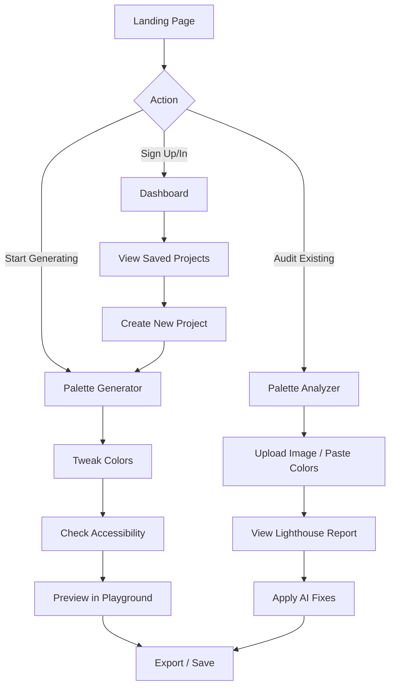

# User Flow: PaletteOS

## Purpose
Map the cognitive and interaction pathways a user takes to accomplish their goals within PaletteOS. This ensures the UX remains intuitive, reducing friction from onboarding to export.

## Architecture

## Detailed Flows

### 1. The "Quick Start" Flow (Unauthenticated)
1. User lands on the homepage.
2. Clicks "Generate Palette".
3. Lands in the Generator. Modifies the primary color.
4. Toggles the "Accessibility" view to ensure WCAG compliance.
5. Clicks "Export" and copies the Tailwind config.
*(Goal: Provide immediate value without forcing signup).*

### 2. The "Audit & Fix" Flow
1. User pastes an existing color scheme into the Analyzer.
2. The UI runs the Scoring Engine and presents a grade (e.g., 65/100).
3. The report highlights three critical contrast failures.
4. User clicks "Auto-Fix". The AI/Color Engine subtly shifts the luminance of the failing colors until they pass.
5. User exports the corrected palette.

### 3. The "Pro" Flow (Authenticated)
1. User logs in.
2. Navigates to Dashboard -> Selects a Brand Kit.
3. Opens the Theme Generator.
4. Previews the theme on a complex dashboard component in the Playground.
5. Saves the theme and syncs it to their team workspace.

## Best Practices
- **Frictionless Entry**: Do not gate core generation/analysis features behind a login wall.
- **Progressive Disclosure**: Show the basic palette first. Reveal complex data (contrast ratios, color blindness simulations) only when the user requests it.

## Risks
- Overwhelming the user with too much data (scores, ratios, hex codes) at once.

## Developer Notes
- Ensure state is synced to `localStorage` for unauthenticated users so they don't lose their work if they refresh.
