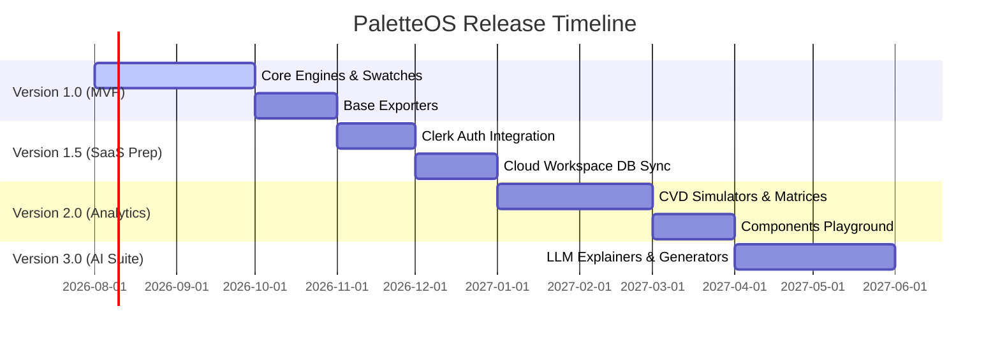

# Version Planning & Roadmap: PaletteOS

## Purpose
This document maps our strategic roadmap to specific semantic version releases. It coordinates engineering milestones with product goals to guide incremental deployment.

---

---

## 1. Version 1.0 — The Core Utility (MVP Launch)
**Target Date**: October 2026
- **Objective**: Launch a fully-functional, client-side, zero-friction color scale utility.
- **Features Included**:
  - Pure TypeScript `color-engine` for Hex/RGB/HSL/OKLCH conversions.
  - Harmony rules builder (Complementary, Monochromatic, Triadic).
  - Interlocking swatches workspace with draggable custom shade scaling.
  - WCAG 2.1 contrast matrix checker.
  - Copy-to-clipboard code exporters (CSS variables, Tailwind themes, raw JSON objects).
  - LocalStorage browser state recovery.

## 2. Version 1.5 — The Cloud Extension (SaaS Foundation)
**Target Date**: January 2027
- **Objective**: Introduce persistence layer and authentication.
- **Features Included**:
  - Clerk Authentication integration (OAuth, Magic Links).
  - Supabase PostgreSQL integration to store saved palettes.
  - Projects dashboard allowing users to organize palettes into workspace folders.
  - Public palette gallery containing user-shared submissions.

## 3. Version 2.0 — The Analytical Matrix
**Target Date**: April 2027
- **Objective**: Provide deep analytical insight (the full "Lighthouse" visual auditor suite).
- **Features Included**:
  - Heuristic Scoring Engine mapping overall compliance scores (0-100).
  - Interactive Component Playground with drag-and-drop themes mapping light/dark mode overrides.
  - Color Blindness CVD Simulators (Brettel projection matrices).
  - Screenshot Analyzer extracting color palettes from uploaded JPEG/PNG configurations.
  - WCAG 3.0 APCA contrast scales support.

## 4. Version 3.0 — The AI Optimization Layer
**Target Date**: June 2027
- **Objective**: Integrate generative AI to automate fixes and describe layout failures.
- **Features Included**:
  - LLM integration API routes (OpenAI / Anthropic Vercel SDK hooks).
  - Generative text prompts ("Create a neon cyberpunk theme for my portfolio").
  - Semantic AI descriptions explaining contrast failures and automated remediation options.

## 5. Long-term Vision (v4.0 and Beyond)
- Continuous Integration CLI tool (`paletteos-cli`) to fail builds if colors fail contrast tests in code templates.
- Figma plugins syncing workspace colors dynamically.
- Enterprise SSO mapping and custom brand color enforcement engines.

## Developer Notes
- Code version tags must follow semantic versioning rules (`vMAJOR.MINOR.PATCH`).
- Keep code clean of hardcoded version checks. Feature gating must rely on subscription properties mapped to user context.
